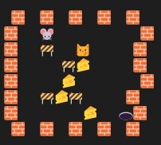

# runaway_mouse

simple game implemented with Reinforcement Learning method

  

in this code mouse should runaway from cat and try to eat most possible cheese
with these conditions:

1. eat cheese has 10 points
2. travel to cat position cause -15 points
3. travel to cat position while cheese over there cause -5 points
4. cat move is random
